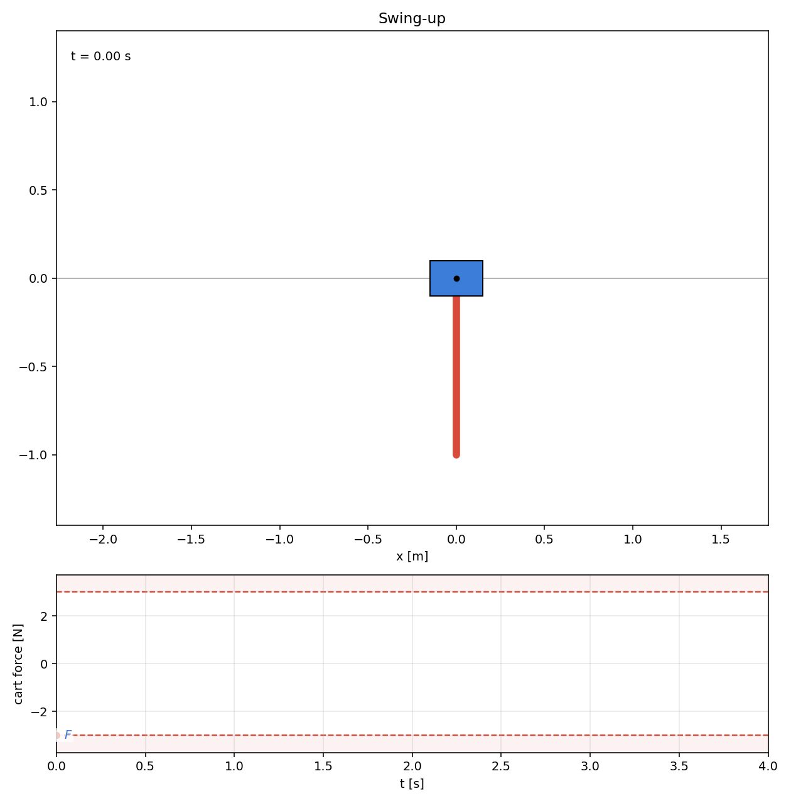
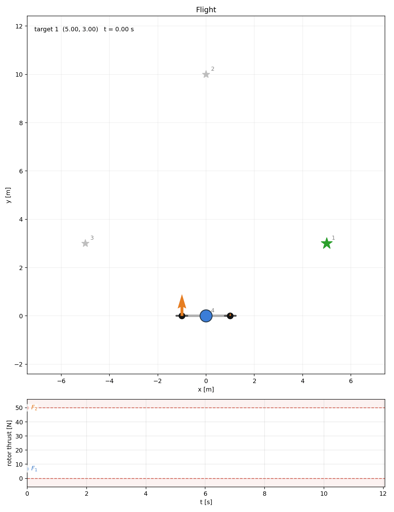

# Iterative Linear-Quadratic-Regulator (iLQR) Solver

A header-only, templated **iterative Linear-Quadratic Regulator (iLQR)** solver for nonlinear trajectory optimization in modern C++.

<p align="center">
  
  
  
  
  
</p>

## ✨ Features

- **Header-only and lightweight.** Problem dimensions are compile-time (`ilqr::Dims<state_dim, control_dim, Scalar>`), so every per-timestep vector and matrix is a fixed-size Eigen type.
- **Just write your continuous dynamics model $\dot{\mathbf{x}} = f(\mathbf{x}, \mathbf{u})$. No hand-derived Jacobians required.** `ilqr::discretize<Dims>(model, dt, integrator_policy, linearization_policy)`
  turns any continuous-time callable into discrete dynamics, with pluggable policies for integration (Euler, Heun or RK4) and linearization (central finite differences or exact forward-mode automatic differentiation).
- **Robust numerics.** Adaptive Levenberg–Marquardt regularization keeps the backward pass stable even on indefinite cost Hessians. The forward pass uses an Armijo backtracking line search against the predicted cost reduction.
- **Cold & warm starts and feedback for free.** `SolveRequest::cold_start` / `::warm_start` let you start from zero controls or seed the solver with an initial control guess.
- **Optimal feedback for free.** The result carries the time-varying optimal feedback gains `K[k]` alongside the optimal trajectory for closed-loop tracking.
- **Composable costs.** Ready-made quadratic terms (state regulator, setpoint and reference tracking, control penalties, terminal costs) that sum via `CompositeCostFunction`. Or implement your own custom cost terms!
- **Concept-checked API.** Dynamics and costs are constrained by C++20 concepts (`Dynamics`, `CostFunction`), so mistakes surface as readable compile errors instead of template backtraces.
- **Introspectable.** Per-iteration diagnostics (cost, regularization, gradient norm, step size) plus CSV export helpers for trajectories and solver stats.

## 🎬 Examples

Three worked examples live under `examples/`, each with a Python animation. Build, run the binary and animate the result:

```bash
./build/examples/<name>/<name>
python examples/<name>/viz/animate_<name>.py
```

### Cart-pole swing-up

States $\mathbf{x} = [x,\ \theta,\ \dot{x},\ \dot{\theta}]^\top$ and control $\mathbf{u} = [F]$. An underactuated nonlinear swing-up classic:

<p align="center"></p>

### Planar quadrotor

States $\mathbf{x} = [x,\ y,\ \theta,\ \dot{x},\ \dot{y},\ \dot{\theta}]^\top$ and controls
$\mathbf{u} = [F_1,\ F_2]^\top$ (rotor thrusts). An underactuated free-flyer, warm-started with gravity-cancelling hover thrust:

<p align="center"></p>

### 2-link robotic arm

States $\mathbf{x} = [q_1,\ q_2,\ \dot{q}_1,\ \dot{q}_2]^\top$ (joint angles and velocities) and controls
$\mathbf{u} = [\tau_1,\ \tau_2]^\top$ (joint torques). A fully-actuated arm reaching through multiple
end-effector targets. It is driven by the nonlinear end-effector position cost in task-space, given by forward kinematics $\mathrm{fk}(\mathbf{q})$ of the arm:

$$\ell_{\mathrm{ee}}(\mathbf{x}) = \frac{w}{2}\ \left\lVert \mathrm{fk}(\mathbf{q}) - \mathbf{p}_{\mathrm{target}} \right\rVert^2,$$

whose exact Hessian can be indefinite, thus exercising the solver's regularization.

<p align="center"></p>

## 🚀 Quick start

The full pipeline (dynamics, costs, solver, solution) mirroring `examples/cartpole/cartpole.cpp`:

```cpp
#include <ilqr/ilqr.hpp>
#include <ilqr/dynamics/autodiff_policy.hpp>  // only needed for ilqr::AutoDiff

using Dims = ilqr::Dims<4, 1, double>;  // 4 states, 1 control

// Continuous dynamics ẋ = f(x, u); templated scalar so autodiff can flow through.
struct CartPole {
    template <typename Scalar_T>
    Eigen::Vector<Scalar_T, 4> operator()(const Eigen::Vector<Scalar_T, 4>& state,
                                          const Eigen::Vector<Scalar_T, 1>& control) const;
};

int main() {
    // Discretize the model (Euler) with exact autodiff Jacobians.
    auto dyn = ilqr::discretize<Dims>(CartPole{}, /*dt=*/0.02,
                                      ilqr::math::EulerStep{}, ilqr::AutoDiff{});

    // Compose the cost from reusable terms (Q, R, Qf are weight diagonals).
    ilqr::QuadraticStateRegulatorCost<Dims> running_cost(Q.asDiagonal());
    ilqr::ControlPenaltyCost<Dims> control_cost(R.asDiagonal());
    ilqr::FinalCost<Dims> terminal_cost(Qf.asDiagonal(), goal_state);
    ilqr::CompositeCostFunction cost(running_cost, control_cost, terminal_cost);

    // Solve from a cold start (zero initial controls).
    ilqr::ILQRSolver solver{dyn, cost, ilqr::SolverConfig<double>{}};
    const auto request = ilqr::SolveRequest<Dims>::cold_start(initial_state, /*horizon=*/150);
    const auto result = solver.solve(request);

    // result.trajectory     — optimal states and controls
    // result.feedback_gains — time-varying K[k] for closed-loop tracking
    // result.status         — Converged / MaxIterations / ...
}
```

## 📦 Installation

A C++20 compiler and CMake ≥ 3.23 are required.

| Dependency | Required | Notes |
|---|---|---|
| [Eigen](https://eigen.tuxfamily.org) ≥ 3.4 | yes | auto-fetched if not installed. See installation [guide](https://eigen.tuxfamily.org/dox/GettingStarted.html).
| [autodiff](https://autodiff.github.io) | examples only | enables the exact automatic-differentiation Jacobian policy. Detected but never fetched. [Install it](https://autodiff.github.io/installation/) to build the examples (without it they are skipped and the core library is unaffected) |
| [GoogleTest](https://github.com/google/googletest) | tests only | auto-fetched if missing |
| Python 3 + `matplotlib`, `numpy`, `pillow` | visualization | `pip install -r examples/viz/requirements.txt` |

To use the library from your own CMake project, `find_package(ilqr)` and link `ilqr::ilqr` or pull it in directly:

```cmake
include(FetchContent)
FetchContent_Declare(ilqr GIT_REPOSITORY https://github.com/alvprado/ilqr-cpp.git GIT_TAG main)
FetchContent_MakeAvailable(ilqr)
target_link_libraries(my_app PRIVATE ilqr::ilqr)
```

## 🔧 Build

```bash
cmake -S . -B build
cmake --build build -j
```

## 🧪 Test

```bash
ctest --test-dir build
```

Runs the GoogleTest suites (`solver`, `cost`, `trajectory`, `discretization`, plus `autodiff` when
the autodiff library is available).

## ▶️ Run examples

```bash
./build/examples/cartpole/cartpole    # also: quadrotor, robotic_arm
```

Each example prints a solve summary and writes trajectory/diagnostics CSVs into `output/`, ready
for the animation scripts shown in [Examples](#-examples).

## 🐳 Docker

If you'd rather not install the entire toolchain (compiler, Eigen, autodiff, Python viz) just to play with and explore the iLQR solver on your machine, build the Docker image with

```bash
docker build -t ilqr .
```

and run an example straight from the CLI (`cartpole`, `quadrotor` or `robotic_arm`) via

```bash
docker run --rm -it ilqr cartpole
```

or drop into the container with an interactive shell in the built project to explore:

```bash
docker run --rm -it ilqr
```

To pull rendered artifacts back onto the host, bind-mount `output/`:

```bash
docker run --rm -it -v "$(pwd)/output:/workspace/output" ilqr quadrotor
```

## 📄 License

MIT — see [LICENSE](LICENSE).
